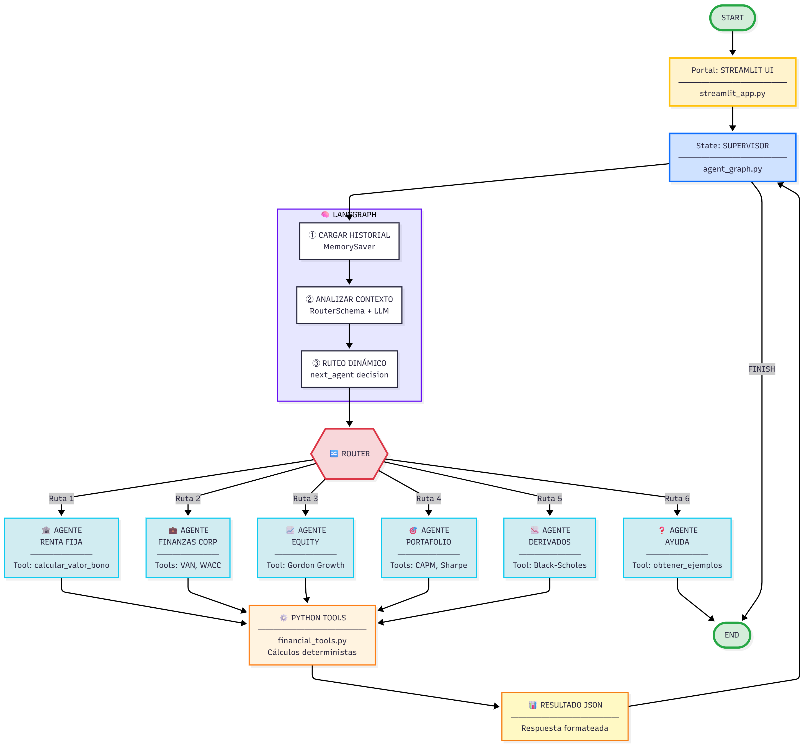

# 💰 Agente Financiero Inteligente (Calculadora CFA - MVP)

Una aplicación web interactiva construida con Streamlit y LangGraph que actúa como un agente financiero inteligente. Es capaz de realizar diversos cálculos financieros estilo CFA mediante una arquitectura multi-agente supervisada.


## 📋 Tabla de Contenidos
1.  [Características](#-características-mvp)
2.  [Arquitectura](#️-arquitectura)
3.  [Ejemplos de Uso](#-ejemplos-de-uso-guía-de-preguntas)
4.  [Instalación Local](#-getting-started-localmente)
5.  [Despliegue](#️-despliegue-en-streamlit-cloud)
6.  [Estructura del Proyecto](#-estructura-del-proyecto)
7.  [¡Contribuye!](#-contribuye)
8.  [Licencia](#-licencia)

## ✨ Características (MVP)

* **Interfaz Web Interactiva:** Creada con Streamlit para facilitar las consultas.
* **Arquitectura Multi-Agente:** Utiliza LangGraph con un agente "Supervisor" que direcciona las consultas al especialista adecuado.
* **Agentes Especialistas:**
    * Renta Fija (Valoración de Bonos)
    * Finanzas Corporativas (VAN)
    * *(En desarrollo: WACC, Equity, Portafolio, Derivados)*
* **Modelo de Lenguaje:** Impulsado por Anthropic Claude 3 Haiku (configurable).
* **Manejo de Errores:** Incluye un "Circuit Breaker" básico para evitar bucles infinitos.
* **Seguridad:** Configuración de API Keys mediante variables de entorno y Streamlit Secrets (no hardcodeado).
* **Código Estructurado:** Organizado en módulos para mejor mantenibilidad (`config`, `tools`, `agents`, `graph`).

## 🏛️ Arquitectura


<p align="center">
  
</p>

El sistema utiliza una arquitectura multi-agente supervisada implementada con LangGraph:

**Flujo de Ejecución:**

1.  El usuario ingresa una consulta en la interfaz de Streamlit.
2.  El agente **Supervisor** recibe la consulta y, basado en su contenido y el historial, decide qué agente especialista debe manejarla.
3.  El **Agente Especialista** (ej. `Agente_Finanzas_Corp`) recibe la tarea, extrae los parámetros necesarios usando el LLM y ejecuta su herramienta específica (ej. `_calcular_van`).
4.  El resultado de la herramienta se devuelve al agente especialista.
5.  El agente especialista formula una respuesta final y la devuelve al Supervisor.
6.  El Supervisor recibe la respuesta. Si la tarea está completa, decide `FINISH`.
7.  La respuesta final se muestra al usuario en Streamlit.

**Componentes Principales:**
- **Portal de Entrada:** Streamlit UI para captura de consultas
- **Supervisor:** Orquestador inteligente con Claude 3 Haiku
- **6 Agentes Especializados:** Renta Fija, Finanzas Corp, Equity, Portafolio, Derivados, Ayuda
- **7 Python Tools:** Cálculos deterministas con numpy/scipy
- **MemorySaver:** Persistencia de contexto durante la sesión

## 🚀 Ejemplos de Uso (Guía de Preguntas)

Una vez que la aplicación esté corriendo, puedes usar estas consultas como ejemplo:

* **Ayuda (Para ver la guía):**
    * `Ayuda`
    * `¿Qué puedes hacer?`

* **Finanzas Corporativas (VAN):**
    * `Calcula el VAN de un proyecto. Inversión inicial 100,000. Flujos [30k, 40k, 50k] a 3 años. Tasa de descuento 10%.`

* **Renta Fija (Bonos):**
    * `Precio de un bono: nominal 1,000, cupón 5% anual, 10 años, YTM 6%.`

* **(Próximamente) Portafolio (CAPM):**
    * `¿Cuál es el costo de equity (Ke) usando CAPM? La tasa libre de riesgo es 3%, el beta es 1.2 y el retorno de mercado es 10%.`

* **(Próximamente) Equity (Gordon Growth):**
    * `Valora una acción con Gordon Growth. El dividendo esperado (D1) es $2.50, el costo de equity (Ke) es 12%, y la tasa de crecimiento (g) es 4%.`

## 🚀 Getting Started (Localmente)

Sigue estos pasos para ejecutar la aplicación en tu máquina local.

### Prerrequisitos

* **Python:** Versión 3.9 o superior recomendada.
* **Git:** Para clonar el repositorio.
* **Anthropic API Key:** Necesitas una clave API de Anthropic.

### Pasos de Instalación

1.  **Clonar el Repositorio:**
    ```bash
    # ¡Reemplaza con la URL de tu repositorio!
    git clone [https://github.com/TU_USUARIO/TU_REPOSITORIO.git](https://github.com/TU_USUARIO/TU_REPOSITORIO.git)
    cd TU_REPOSITORIO
    ```

2.  **Crear y Activar Entorno Virtual:** (Altamente recomendado)
    ```bash
    # Crear entorno
    python -m venv venv
    
    # Activar entorno
    # Windows (CMD/PowerShell)
    .\venv\Scripts\activate
    # macOS/Linux
    source venv/bin/activate
    ```
    Deberías ver `(venv)` al inicio de tu prompt.

3.  **Instalar Dependencias:**
    ```bash
    pip install -r requirements.txt
    ```

4.  **Configurar API Key (Local):**
    * Crea un archivo llamado `.env` en la raíz del proyecto.
    * Añade tu API key de Anthropic dentro de este archivo:
        ```ini
        # .env
        ANTHROPIC_API_KEY="sk-ant-api03-..." # Reemplaza con tu clave real
        ```
    * **IMPORTANTE:** Asegúrate de que el archivo `.env` esté listado en tu `.gitignore` para no subirlo accidentalmente a GitHub.

### Ejecutar la Aplicación

1.  Asegúrate de que tu entorno virtual esté activado.
2.  Ejecuta Streamlit desde la carpeta raíz del proyecto:
    ```bash
    streamlit run streamlit_app.py
    ```
3.  Abre tu navegador y ve a la dirección que indique Streamlit (normalmente `http://localhost:8501`).

## ☁️ Despliegue en Streamlit Cloud

1.  **Sube tu Código a GitHub:** Asegúrate de que tu repositorio esté actualizado en GitHub (`git push`), **sin** incluir el archivo `.env` ni la carpeta `venv`.
2.  **Conecta Streamlit Cloud:**
    * Ve a `share.streamlit.io` y haz clic en "New app".
    * Selecciona tu repositorio de GitHub, la rama (`main`) y el archivo principal (`streamlit_app.py`).
3.  **Configura los Secrets:**
    * Antes de hacer clic en "Deploy!", ve a "Advanced settings..." > "Secrets".
    * Pega tu API key usando el formato TOML:
        ```toml
        ANTHROPIC_API_KEY = "sk-ant-api03-..." 
        ```
    * Guarda los secretos.
4.  **Deploy:** Haz clic en "Deploy!".

## 📁 Estructura del Proyecto

El repositorio está organizado de forma modular para facilitar la mantenibilidad y la adición de nuevos agentes o herramientas:
```bash
tu_repositorio/
├── agents/             # Define los agentes especialistas y el supervisor
│   ├── __init__.py
│   └── financial_agents.py
├── graph/              # Construye y compila el StateGraph de LangGraph
│   ├── __init__.py
│   └── agent_graph.py
├── tools/              # Define las @tools (funciones de cálculo)
│   ├── __init__.py
│   ├── financial_tools.py
│   ├── help_tools.py
│   └── schemas.py      # Pydantic schemas para las tools
├── config.py           # Configuración (ej. get_llm())
├── requirements.txt    # Dependencias del proyecto
├── streamlit_app.py    # El punto de entrada de la app web
├── .env.example        # Ejemplo de variables de entorno
├── .gitignore          # Archivos a ignorar
└── README.md           # Esta documentación
```
## 🤝 ¡Contribuye!

¡Este es un proyecto abierto y las contribuciones son bienvenidas! La arquitectura está diseñada para que añadir nuevas herramientas sea fácil.

Si te gustaría contribuir (por ejemplo, añadiendo el cálculo de WACC o CAPM):

1.  Haz un **Fork** del repositorio.
2.  Crea una nueva rama (`git checkout -b feature/nueva-calculadora`).
3.  Añade tu nueva `@tool` en `tools/financial_tools.py`.
4.  (Opcional pero recomendado) Crea un nuevo `Agente_Especialista` en `agents/financial_agents.py` y añádelo al `agent_nodes`.
5.  Actualiza el `supervisor_system_prompt` para que sepa de tu nueva herramienta.
6.  Haz **Commit** y **Push** de tus cambios.
7.  Abre un **Pull Request**.

## 📜 Licencia

Este proyecto está bajo la Licencia MIT. (Te recomiendo crear un archivo `LICENSE` en tu repositorio con el texto de la licencia MIT).


